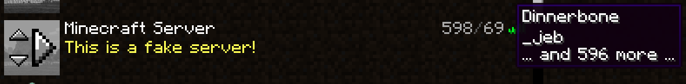
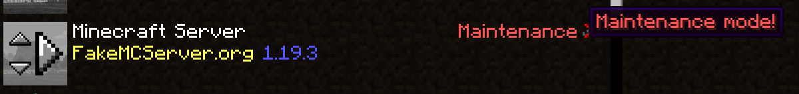
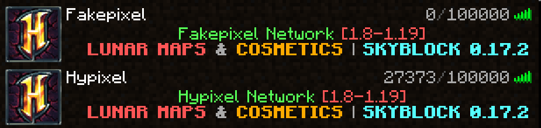

<h1 align="center">Fake Minecraft Server</h1>

<div align="center">

[](LICENSE)
[](pom.xml)
[](pom.xml)
[](pom.xml)
[](https://jenkins.alka.dev/job/fake-mc-server/)


[](https://jenkins.alka.dev/job/fake-mc-server/)

</div>

## Overview
This program is a fake Minecraft server featuring customizable:
- Server list icon
- MOTD
- Protocol & version name
- Players (with sample)
- Kick message

## Example in image






## CLI
You can [download the CLI](https://jenkins.alka.dev/job/fake-mc-server/) and use it as long as you have java version 21 or above installed.

### Usage
````
Usage...: java -jar FakeMCServer-CLI.jar [options...]
Example.: java -jar FakeMCServer-CLI.jar -start -logs server.log

Options:
   -help, -h          Display usage
   -version, -v       Display version
   -start             Start server
   -logs              What you want to log, separated by a comma. Values: NONE, DEBUG, PING, KICK, MOTD. (default: 'PING,KICK')
   -log-file          Log file pattern (example: server.log). By default no log file is generated.
   -config            Configuration path (default: 'config.json')
   -config-override   Skip the configuration file, and override with raw JSON
````

### Configuration
If no configuration file has been found, the program will try to create a new one.

**Default configuration:**
````json
{
    "socket_server": {
        "host": "0.0.0.0",
        "port": 25565
    },
    "minecraft_server": {
        "server_ip": null,
        "protocol": {
            "allow_all_clients": true,
            "versions": []
        },
        "version_name": "Minecraft",
        "motd": "A Minecraft server",
        "players": [],
        "connected_players": 0,
        "slots": 0,
        "kick_message": "Disconnected",
        "server_icon": null
    }
}
````

**Description:**

| Name                | Type                                                                                    | Description                                                                                                                                                                                                                                                                                  |
|---------------------|-----------------------------------------------------------------------------------------|----------------------------------------------------------------------------------------------------------------------------------------------------------------------------------------------------------------------------------------------------------------------------------------------|
| `host`              | String                                                                                  | Main socket host. Must be a valid host, *this is not the "Minecraft server" IP address*. I recommend leaving it to `0.0.0.0` or `127.0.0.1`, as long as it is a valid socket host.                                                                                                           |
| `port`              | Int                                                                                     | Main socket port, will also be the port of the fake Minecraft server.                                                                                                                                                                                                                        |
| `server_ip`         | String                                                                                  | *This* is your fake Minecraft IP. If this field is not null, the socket server checks the IP requested by the Minecraft client before continuing the request. This is why I recommend leaving the socket host to your local address/machine address, and setting the Minecraft IP from here. |
| `allow_all_clients` | Boolean                                                                                 | If true, the fake Minecraft server will be compatible with all versions of minecraft.                                                                                                                                                                                                        |
| `versions`          | List of [Protocol Version Numbers](https://wiki.vg/Protocol_version_numbers)            | If the fake Minecraft server does not allow all clients, set your [Protocol Version Numbers](https://wiki.vg/Protocol_version_numbers) here.                                                                                                                                                 |
| `version_name`      | String (with [the legacy colors](https://minecraft.wiki/w/Formatting_codes))            | Version name. Shown to the client instead of the number of players if the Minecraft version is not compatible with the fake server.                                                                                                                                                          |
| `motd`              | String (with [the minimessage format](https://docs.advntr.dev/minimessage/format.html)) | Message of the day                                                                                                                                                                                                                                                                           |
| `players`           | List of String (with [the legacy colors](https://minecraft.wiki/w/Formatting_codes))    | Player sample (appears when hovering over the number of players)                                                                                                                                                                                                                             |
| `connected_players` | Int                                                                                     | Number of connected players                                                                                                                                                                                                                                                                  |
| `slots`             | Int                                                                                     | Slots                                                                                                                                                                                                                                                                                        |
| `kick_message`      | String (with [the minimessage format](https://docs.advntr.dev/minimessage/format.html)) | The message when a player tries to connect                                                                                                                                                                                                                                                   |
| `server_icon`       | String                                                                                  | Server icon. Can either be the path to your image (example: `server-icon.png`), or the image directly in base64. If you put the image directly in base64, be sure that your string begins with `data:image/png;base64,`.                                                                     |

## Use it as a dependency
````xml
<repository>
    <id>alka-repo</id>
    <url>https://repo.alka.dev/repository/maven-public/</url>
</repository>

<dependency>
    <groupId>dev.alka</groupId>
    <artifactId>fake-mc-server</artifactId>
    <version>VERSION</version>
</dependency>
````

### Example of simple fake server

````java
import dev.alka.fakemcserver.FakeMCServer;

public static void main(String[] args) {
    // Init a default logger
    FakeMCServerLogs.initLogger();

    // Write to server.log
    FakeMCServerLogs.allowFileOutput("server.log");

    // Create a new FakeMCServer
    FakeMCServer fakeMCServer = new FakeMCServer();

    // Edit configuration
    fakeMCServer.setProtocol(767); // 1.21
    fakeMCServer.setMotd("<red>Maintenance!");
    fakeMCServer.setKickMessage("<red>The server is not available at this moment, sorry!");
    // ...

    // Start server
    fakeMCServer.startServer();

    // Add shutdown hook
    Runtime.getRuntime().addShutdownHook(new Thread(fakeMCServer::stopServer, "Shutdown hook"));
}
````

By default, if no logger as been initiated the logs are kept in a journal as an ArrayList.

You have full control on the journal. If you want to keep it alongside the logger, or disable it once a logger as been initialized, it's up to you with the following methods:
- `FakeMCServerLogs.disableJournal();`
- `FakeMCServerLogs.enableJournal();`

## Big thanks to the original creators
xxmicloxx, lorenzop and [michidk](https://github.com/michidk)
